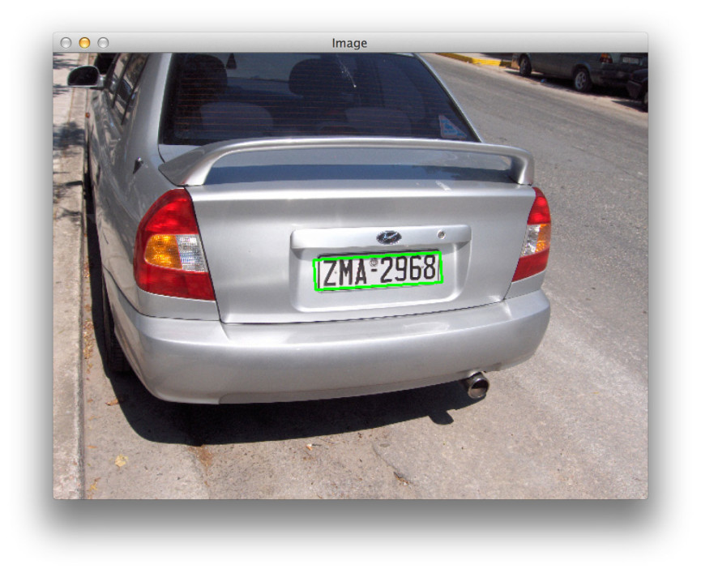
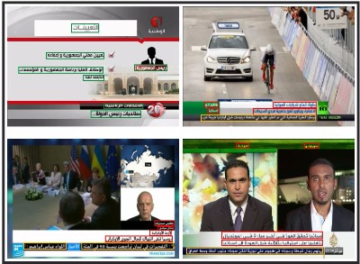
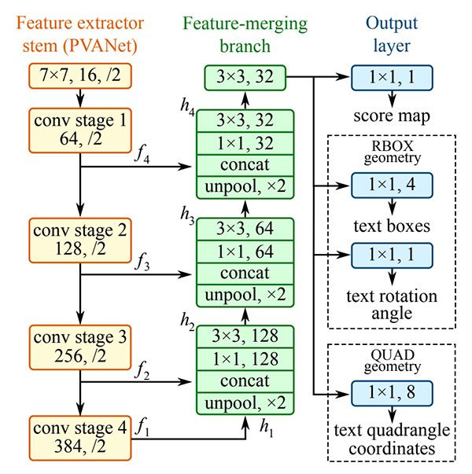
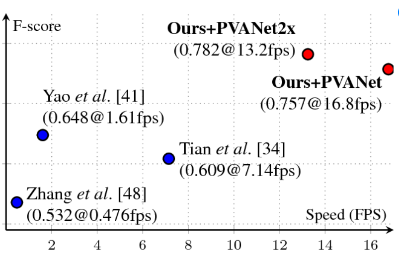
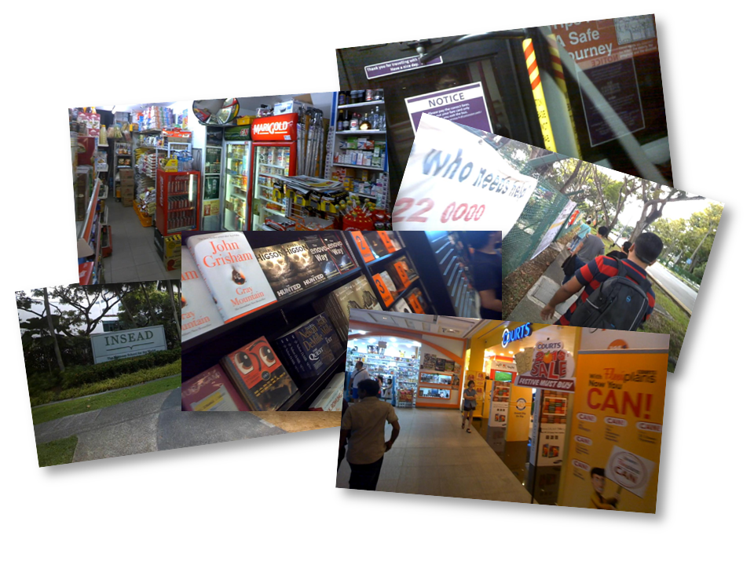

# License Plate Detection - 차량 번호판 인식 실전 프로젝트

## Text Detection 문제영역 소개
이미지 내에 텍스트가 존재하는 영역의 위치정보를 Bounding Box로 찾는 문제 영역입니다. 의미 정보와 상관 없이 Text가 어느 위치에 있는 지를 찾아줍니다.   
일반적인 Object Detection과의 차이점은 Rotation Angle까지 고려해서 Detection을 하기 때문에, Rotation Angle을 고려하지 않는 Object Detection보다 좀 더 정확하게 진행할 수 있습니다.

그림 1 - Text Detection 모델의 결과 - (Text의 위치 
정보에 대한 Bounding Box) [1]

Text Detection 기술은 교통 카메라에서 자동차 번호판 인식, 시각적 검색 등 다양한 분야의 현실세계 문제에 활발히 사용 되고 있습니다.

그림 2 - Text Detection 기술을 활용한 자동차 번호판 인식 [2]

그림 3 - News Video에서의 Text Detection [3]

## EAST (Efficient and Accuracy Scene Text)

중국의 MEGVII라는 회사에서 2017년에 제안한 논문입니다. EAST 모델은 기존 기법들보다 간결한 구조를 취하고 있다는 장점을 가지고 있습니다. EAST에서 사용하는 모델은 Stem Layer(Feature extraction layer), Feature-merging branch layer, Output layer 이렇게 세 가지 형태로 구성됩니다. 또한 EAST 모델은 기존 모델 대비 F1 score도 높고, 속도도 빨라서 획기적인 text model로 알려져 있습니다.
 

그림 5 - EAST 모델의 아키텍쳐 [6]

그림 5 - EAST 모델의 아키텍쳐 [7]

## OCR Open Dataset1 - ICDAR 2015

ICDAR(Incidental Scene Text Dataset)은 1500장 이미지로 구성되어 있으며, 1000장은 Training 나머지는 testing으로 사용합니다. 4개의 꼭지점 좌표가 annotation으로 되어 있습니다. 2013년 Dataset은 229장입니다. [8]

그림 6 - Google glass로 촬영한 icdar 샘플 사진

# OCR Open Dataset2 - COCO-Text Dataset

COCO-Text Dataset은 63686장의 이미지와 annotation들이 있습니다. annotation은 AABB 형태로 되어 있는데 RBOX의 special case로 rotaion angle이 0인 정방향의 label 형태로 볼 수 있습니다. 

그림 7 - COCO Dataset 샘플 사진 [9]

# Car License Plate recognition project 

차량 번호판 인식에 대한 연구는 이전의 hand crafted를 이용한 컴퓨터 비전 분야에서 활발하게 진행되고 있는 주제입니다. 그러나 최근에는 고속 영상에서의 번호 인식 등을 위해 딥러닝 기술과 접목되어 연구되고 있습니다. 

성능이 높은 Text Detection 모델인 **EAST 모델을 활용하여 차량 번호판에서 텍스트 영역을 검출**하는 프로젝트를 진행해보았습니다. **EAST 공식 문서와 Github 글을 참고 하였고, inflearn AI-School 강사님의 커리큘럼을 따라**해보았습니다. [10]

### License Plate Dataset에 대해 CRAFT Detector 학습
* 기존 CRAFT Dataset을 Custom Dataset인 License Plate Detection Dataset에 적합한 파라미터로 Fine-Tuning을 해본다. 
[keras-ocr의 예제코드](https://keras-ocr.readthedocs.io/en/latest/examples/fine_tuning_detector.html)를 참조하되 get_license_plate_detector_dataset이라는 새로운 function을 만들고, function의 반환값을 get_icdar_2013_detector_dataset과 같은 shape으로 만든 후 나머지 과정을 똑같이 진행함

CRAFT Detector가 license plate detection을 잘 수행하도록 학습이 진행될 것임

keras-ocr 
Detection 모듈 : CRAFT 구현
Recognition CRNN 사용
해당 구현체를 가져다가 Fine-Tuning 하는 실습을 진행했습니다. 

### 강의에서 제공된 License Plate Dataset 
* image 
    * 222장의 차량번호판이 포함된 이미지 
* Ground truth Annotation 
    * License Plate의 꼭짓점 절대좌표가 띄어쓰기로 split 되어서 시계방향으로 x_1 y_1 x_2 y_2 x_3 y_3 x_4 y_4 label 들어가 있음

### 진행 방법
* 1. 제공된 Dataset에서 jpg 파일과 txt 파일에서 필요한 정보들을 parsing해서 keras-ocr 예제의 get_license_plate_detector_dataset 함수의 반환값과 같은 형태로 만들어준다. 
* 2. license plate detector 데이터셋에 맞게 CRAFT 파라미터 FINE-Tuning

airbnb 데이터 사이언스 팀과 동일하게 Google Open Images Dataset V4에서 30개의 Amenity label만을 추출하였습니다. 검출 타겟이 되는 30개의 amenity class는 아래와 같습니다.

> ['Toilet', 'Swimming pool', 'Bed', 'Billiard table', 'Sink',
'Fountain', 'Oven', 'Ceiling fan', 'Television', 'Microwave oven',
'Gas stove', 'Refrigerator', 'Kitchen & dining room table', 'Washing machine', 'Bathtub',
'Stairs', 'Fireplace', 'Pillow', 'Mirror', 'Shower',
'Couch', 'Countertop', 'Coffeemaker', 'Dishwasher', 'Sofa bed',
'Tree house', 'Towel', 'Porch', 'Wine rack', 'Jacuzzi']

전체 1,743,042장의 이미지에서 위 30개의 amenity class를 포함한 이미지를 선별한 결과 **총 34,835장의 이미지**를 학습을 위한 이미지로 선별하였습니다. 이중에서 **90%를 트레이닝 데이터로, 10%를 Evaluation을 위한 테스트 데이터**로 활용하였습니다.

# Training

CenterNet 모델을 이용해서 30개의 Amenity class를 포함하고 있는 34,835장의 이미지의 90%인 31,351장의 이미지를 이용해서 140,000 step의 트레이닝을 진행하였습니다.

그림 7 - 140,000 step 동안의 트레이닝 과정에 대한 TensorBoard 스크린샷

# Evaluation

140,000 step의 트레이닝 이후 34,835장의 이미지의 10%인 3,483장의 테스트 이미지에 대해 다음과 같은 Evaluation 결과를 얻을 수 있었습니다. 

그림 8 - Evaluation 과정에 대한 TensorBoard 스크린샷

전체 테스트 이미지에 대해서는 IoU 0.5이상을 정답으로 간주했을때 약 **14.32의 mAP 값**을 얻을 수 있었습니다.
u
개별 class 별로 IoU 0.5 이상을 정답으로 간주했을 때 Swimming pool 레이블 같은 경우 61.28의 mAP 값, Bathtub 레이블 같은 경우 5.33의 mAP 값, Oven 레이블 같은 경우는 19.38의 mAP 값을 얻을 수 있었습니다.

# Future Work

위의 예시에서 볼 수 있듯이 개별 레이블 별로 mAP 값의 편차가 심한 모습을 볼 수 있습니다. 이는 여러 원인이 있을 수 있지만 각 레이블에 대응되는 Training 이미지 개수의 편차가 심한 것이 주요 원인 중 하나로 볼 수 있습니다. 따라서 airbnb 데이터 사이언스팀에서 진행한 것처럼 추가 이미지를 수집한 뒤 이에 대한 정답을 labelling 한뒤 추가 데이터를 이용해서 Training하는 과정을 통해 mAP를 향상시키는 작업을 추후 작업으로 진행해볼 계획입니다.

# References

[1] [https://docs.aws.amazon.com/ko_kr/rekognition/latest/dg/text-detection.html](https://docs.aws.amazon.com/ko_kr/rekognition/latest/dg/text-detection.html)

[2] [https://customers.pyimagesearch.com/lesson-sample-segmenting-characters-from-license-plates/](https://customers.pyimagesearch.com/lesson-sample-segmenting-characters-from-license-plates/)

[3] [http://tc11.cvc.uab.es/datasets/AcTiV_1](http://tc11.cvc.uab.es/datasets/AcTiV_1)

[keras_ocr Documentation Fine-tuning the detector ](https://keras-ocr.readthedocs.io/en/latest/examples/fine_tuning_detector.html)

[2] [keras_ocr Dataset.py Github](https://github.com/faustomorales/keras-ocr/blob/master/keras_ocr/datasets.py)

[3] [https://www.youtube.com/watch?v=NrmMk1Myrxc](https://www.youtube.com/watch?v=NrmMk1Myrxc)

[4] [https://medium.com/airbnb-engineering/amenity-detection-and-beyond-new-frontiers-of-computer-vision-at-airbnb-144a4441b72e](https://medium.com/airbnb-engineering/amenity-detection-and-beyond-new-frontiers-of-computer-vision-at-airbnb-144a4441b72e)

[5] [https://www.tensorflow.org/about/case-studies?hl=ko](https://www.tensorflow.org/about/case-studies?hl=ko)

[6] [https://www.pyimagesearch.com/2018/08/20/opencv-text-detection-east-text-detector/](https://www.pyimagesearch.com/2018/08/20/opencv-text-detection-east-text-detector/)

[7] [https://www.researchgate.net/figure/Performance-versus-speed-on-ICDAR-2015-15-text-localization-challenge-As-can-be-seen_fig3_316015737](https://www.researchgate.net/figure/Performance-versus-speed-on-ICDAR-2015-15-text-localization-challenge-As-can-be-seen_fig3_316015737)

[8] [https://rrc.cvc.uab.es/?ch=4](https://rrc.cvc.uab.es/?ch=4)

[9] [https://rrc.cvc.uab.es/?ch=5&com=tasks](https://rrc.cvc.uab.es/?ch=5&com=tasks)

[10] [https://www.inflearn.com/course/tensorflow-%EC%8B%A4%EC%A0%84%ED%94%84%EB%A1%9C%EC%A0%9D%ED%8A%B8-%EC%98%AC%EC%9D%B8%EC%9B%90/dashboard](https://www.inflearn.com/course/tensorflow-%EC%8B%A4%EC%A0%84%ED%94%84%EB%A1%9C%EC%A0%9D%ED%8A%B8-%EC%98%AC%EC%9D%B8%EC%9B%90/dashboard)

keras_ocr library를 설치한 후 
icdar_2013 detector dataset에 맞게 학습시키는 것이 들어가 있었음
해당 dataset의 return 값으로 넘어 오는 것이 
튜플들의 list가 넘어옴
튜플의 첫 번째 요소 : 이미지 path 경로
두 번째 : 정답 position에 대한 vector와 그에 대한 string 값
세 번째 : 1이라는 값이 할당되어 있음

새로운 custom function을 하나 만듬
과정에서 return 값이 위 형상과 같도록
첫 번째 image path값, 두 번째 포지션 벡터 list, 세번째 1이 들어있는 튜플들 list를 만들어주는 function 작성

나머지 부분은  
전체 data를
train validation split하고, 
image augmentation library로 affine transform
GaussianBluer
Multiply Augmentation 
적용해줌
각각을 generator 형태로 묶어줌

sanity check로 형상을 한 번 본 다음에, 

fit generator 호출을 통해서 
batch를 하나씩 묶어서 ICDAR2013 Dataset에 맞게
Fine tuning 하는 기본 예제 코드

해야될 것 우리 custom data에 맞게 return
아까 get_icdar_2013_detector dataset
이 function의 내부 로직을 보면, 
ICDAR 2013 이미지를 이쪽 경로에서 다운 받고, 압축 풀고 
거기있는 그 전체, 
또 정답 ground truth 압축 파일을 다운로드 받고,
압축 풀고
txt 파일에 들어가있는 정답들을 for loop으로 iteration 하면서
필요한 정보들을 parsing해서
position vector
결국 bounding box 정답이 position vector로 꼭짓점 좌표로 되어 있는 것임
그걸 parsing 해서 
parsing을 한 다음에, 최종적으로는 계속 말씀드린 것처럼
tuple들에 list 
dataset이 list인데 

list 안에 3가지 요소값을 가진 튜플을 자료구조로  
만들어서 넣어주는데, 
그 때 tuple의 첫 번째 요소가 image_path, 두 번째 요소 position 벡터, 세 번째 요소 1이라는 값을 가진 튜플들의 list를 만들어서 return

다른 dataset에 text detection을 해보고 싶으면,
CRAFT 모델을 license plate detector에 적용했던 것을 응용해서
detection 하고 싶은 대상을 튜플 형태 리스트로 만들어주는
custom function을 작성해서 동일 과정을 진행하면 
license plate 말고 다른 dataset에 대해서도, 
최신 deep learning 모델인 CRAFT를 이용해서 
TEXT DETECTION 컴퓨터비전 Task를 잘 수행하실 수 있을 것임

정리
1. custom dataset의 일종인 license_plate_detection 데이터를
feeding 할 수 있는 함수를 만들어서
그거에 관련된 feeding 함수를 토대로,
parameter를 license plate detection이 잘 검출될 수 있는 방향성으로 다시 학습을 fine tuning을 시켜주었음
그렇게 학습이 끝난 모델에 대해서 
validation data에 대해서,
prediction을 해서 어떤
정성적으로 만든 모델이 동작하고 있는지를 분석해보았음

